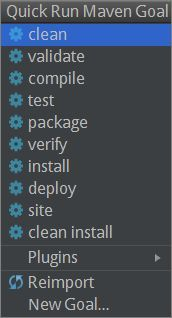
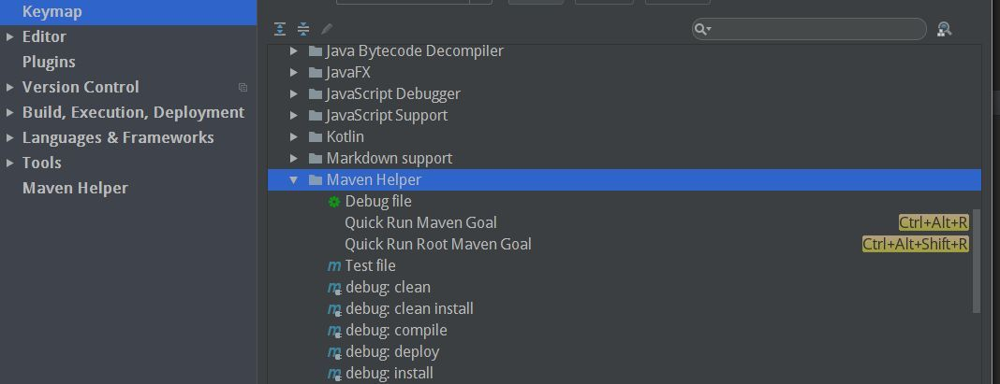

# Intellij Idea

## Maven Helper

Idea 官方推荐的，被成为是 "使用 Maven 必备的插件"(A must have plugin for working with Maven)。

[Maven Helper 官方地址](https://plugins.jetbrains.com/plugin/7179-maven-helper)

### 介绍

> 翻译自 [Maven Helper首页](https://plugins.jetbrains.com/plugin/7179-maven-helper)

Maven Helper 提供：

- 简单方便的查找和排除依赖冲突
- 用来为包含当前文件的模块运行/调试 maven goal 的操作
- 运行/调试当前测试文件的操作
	* 如果 maven-surefire-plugin 被配置为 skip 或者 exclude 测试，`verify` goal 将被使用。在 https://github.com/harishkannarao/MavenSurefireFailsafeExamples 查看不同的配置风格。

### 安装

打开 "File" --> "Settings" --> "Browse Repository", 搜索 "maven helper":

直接安装即可。

### 使用

- 在Idea的编辑器中右键 | ``Run Maven
- 在项目（包括子项目）上右键 | ``Run Maven

	

- 使用快捷键 `CTRL + ALT + R`

	

- 自定义 goals: "File" --> "Settings" --> "Maven Helper", 点 "create"

	

- 自定义快捷键: "File" --> "Settings" --> "Keymap" --> "Plug-ins" -->  "Maven Helper"

	

- 打开 pom 文件，点底下的 "Dependency Analyzer" tab，

Open pom file, click on 'Dependency Analyzer' tab, right click in the tree for context actions.

